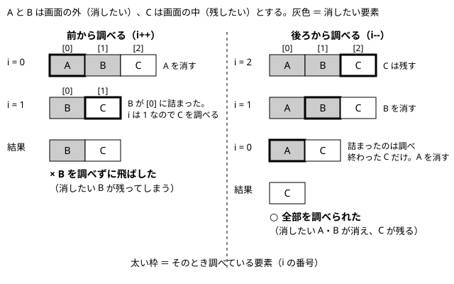

# 第25回　実践：Web ゲームプログラミング４（敵と、画面外の削除）

- **前回**：弾を撃てるようにした
- **今回**：敵を出し、画面外の弾と敵を消す
- **次回**：弾が敵に当たるようにする

## 実習時のフォルダ構成

`Web_名前` の中に `25` フォルダを作る。第 24 回の `sample` フォルダと `exercise` フォルダを、`25` の中にコピーして、続きから作る。

```
Web_名前
└─ 25
   ├─ sample          ← 第 24 回の sample をコピーする
   │  ├─ index.html
   │  ├─ style.css
   │  └─ main.js
   └─ exercise        ← 第 24 回の exercise をコピーする
      ├─ index.html
      ├─ style.css
      └─ main.js
```

- `sample`：講義で使うサンプル（講義内容のコードは、`sample/main.js` に書き足す）
- `exercise`：自分のシューティングゲーム（演習１〜２）
- `index.html` と `style.css` は、変更しない。

## 講義内容

`sample/main.js` に書き足す。書いたら `sample/index.html` をブラウザで開いて確認する。

### 1. 前回の復習

- 弾はオブジェクトの配列 `bullets` で管理する。スペースキーで `push` して追加し、`for` で全部を動かして描く。
- 画面の外に出た弾も、配列に残り続けていた（`bullets.length` が増え続けた）。

今回は、敵を出す。そして、画面の外に出た敵と弾を、配列から消す方法を学ぶ。

### 2. 今回の `main.js` の並び

```
// ===== 準備 =====
// ===== ゲームの状態 =====
// ===== 自機・弾・敵 =====   ← 見出しを変え、敵の配列を追加する
// ===== キー入力 =====
// ===== 更新 =====           ← updateEnemies・removeEnemies・removeBullets を追加し、update から呼び出す
// ===== 描画 =====           ← drawEnemies を追加し、draw から呼び出す
// ===== ゲームループ =====
```

### 3. 敵の配列を用意する

見出しを `// ===== 自機・弾・敵 =====` に変えて、`enemies` を追加する。

```javascript
// ===== 自機・弾・敵 =====
const player = { x: 184, y: 440, w: 32, h: 32, speed: 5 };
let bullets = [];
let enemies = [];
let shotTimer = 0;               // 次の弾を撃てるまでのフレーム数
```

### 4. 敵を出す・動かす（updateEnemies）

「更新」の部分の `updateBullets` の下に、`updateEnemies` を追加する。弾（第 24 回）と同じ形で作る。

```javascript
function updateEnemies() {
  // 60 フレーム（約 1 秒）ごとに、敵を 1 体出す
  if (frameCount % 60 === 0) {
    enemies.push({ x: Math.floor(Math.random() * (canvas.width - 32)), y: -32, w: 32, h: 32, speed: 2 });
  }
  // すべての敵を下へ動かす
  for (let i = 0; i < enemies.length; i++) {
    enemies[i].y += enemies[i].speed;
  }
}
```

- `frameCount % 60 === 0`：フレーム数を 60 で割った余りが 0 のとき、つまり 60 フレームに 1 回（約 1 秒に 1 回）`true` になる。
- 出現位置の `x` は、第 18 回で学んだ「`Math.floor(Math.random() * 個数) + 最小値`」の形。ここでは最小値が 0 なので、`+ 0` を省略している。
- 個数を `canvas.width - 32`（キャンバスの幅から、敵の幅を引いた値）にすると、x 座標は 0〜367 のどれかになる。敵が画面の右からはみ出さない。
- y 座標を `-32`（敵の高さの分だけ上）にすると、画面の上の外から、すっと入ってくるように見える。

| | 弾（第 24 回） | 敵（今回） |
|---|---|---|
| 追加するとき | スペースキーを押したとき | 60 フレームごと |
| 追加の方法 | `bullets.push({ ... })` | `enemies.push({ ... })` |
| 動かす方向 | 上へ（`y -= speed`） | 下へ（`y += speed`） |

「描画」の部分の `drawBullets` の下に `drawEnemies` を追加する。

```javascript
function drawEnemies() {
  ctx.fillStyle = "#ff4444";
  for (let i = 0; i < enemies.length; i++) {
    ctx.fillRect(enemies[i].x, enemies[i].y, enemies[i].w, enemies[i].h);
  }
}
```

`draw` を次のようにし、`update` の中の `updateBullets();` の次の行に `updateEnemies();` を書き足す（`update` の最終的な形は、講義 7 で示す）。

```javascript
function draw() {
  drawBackground();
  drawPlayer();
  drawBullets();
  drawEnemies();
}
```

- 敵が上から出てきて、下へ動く。
- コンソールに `enemies.length` と入力すると、画面の下に消えた敵も配列に残り、数が増え続けていることが分かる。

### 5. 配列から要素を消す（splice）と、後ろから調べる理由

画面の外に出た敵を、配列から消す。配列から要素を取り除くには、`splice` を使う。

- `配列.splice(番号, 1);`：その番号の要素を、1 つ配列から取り除く。
- 例：`[10, 20, 30]` に `splice(1, 1)` をすると `[10, 30]` になる。取り除いた後ろの要素（30）が、1 つ前の番号に詰まる。

`for` で調べながら削除するときは、調べる順番に注意する。



- 前から調べると、消した後ろの要素が前に詰まり、調べずに飛ばしてしまう要素が出る。
- 後ろから調べると、詰まるのは調べ終わった要素だけなので、飛ばしが起きない。後ろから回すには、第 19 回で学んだ形を使う：`for (let i = 配列.length - 1; i >= 0; i--)`。
- この授業では、「配列から要素を削除する `for` 文は、後ろから回す」ことをルールにする。

### 6. 画面外の敵を消す（removeEnemies）

`updateEnemies` の下に、`removeEnemies` を追加する。

```javascript
// 画面の下に出た敵を消す
function removeEnemies() {
  for (let i = enemies.length - 1; i >= 0; i--) {
    if (enemies[i].y > canvas.height) {
      enemies.splice(i, 1);
    }
  }
}
```

- 敵の上端（`enemies[i].y`）が、キャンバスの高さより大きくなったら、敵は画面の下に完全に出ている。その敵を `splice` で消す。

### 7. 同じ考え方で、画面外の弾も消す（removeBullets）

第 24 回で残したままにしていた弾も、同じ形で消せる。`removeEnemies` の下に、`removeBullets` を追加する。

```javascript
// 画面の上に出た弾を消す
function removeBullets() {
  for (let i = bullets.length - 1; i >= 0; i--) {
    if (bullets[i].y + bullets[i].h < 0) {
      bullets.splice(i, 1);
    }
  }
}
```

- `removeEnemies` と比べると、違うのは「配列の名前」と「画面の外に出たかの条件」だけ。
- 弾は上へ動くので、弾の下端（`bullets[i].y + bullets[i].h`）が 0 より小さくなったら、画面の上に完全に出ている。

「更新」の部分の `update` を、次のようにする。

```javascript
function update() {
  frameCount += 1;
  updatePlayer();
  updateBullets();
  updateEnemies();
  removeEnemies();
  removeBullets();
}
```

- 全員を動かしてから、画面の外に出たものを消す。
- コンソールに `bullets.length`・`enemies.length` と入力して、数が増え続けなくなったことを確かめる。

### 8. うまく動かないとき

| 症状 | 確認すること |
|---|---|
| 敵が出ない | `update` から `updateEnemies` を、`draw` から `drawEnemies` を呼んでいるか。`frameCount % 60 === 0` の書き方 |
| 敵が画面の右からはみ出す | 出現位置の `canvas.width - 32` の `32` が、敵の幅と同じか |
| `bullets.length` が増え続ける | `update` から `removeBullets` を呼んでいるか。条件（`< 0`） |
| 消えてほしくない敵まで消える | `removeEnemies` の条件（`> canvas.height`）の向き |

## 演習

`exercise/main.js`（自分のシューティングゲーム）に書く。

### 演習１　敵を出す

- 講義と同じように、敵が画面の上から出てきて、下へ動くようにする。
- 敵の色・大きさ・速さ・出現の間隔は、自分で決める。
- 敵の大きさを変えたときは、出現位置の計算（`canvas.width - 32`）と、最初の y 座標（`-32`）の `32` も、同じ値に変える。

### 演習２　画面外の敵と弾を消す

- 講義と同じ `removeEnemies` を作り、画面の下に出た敵を消す。
- `removeBullets` は、次の空欄（`＿＿＿＿`）を埋めて完成させる。`removeEnemies` と見比べるとよい。

```
function removeBullets() {
  for (let i = ＿＿＿＿; i >= 0; i--) {
    if (bullets[i].y + bullets[i].h < 0) {
      ＿＿＿＿;
    }
  }
}
```

- `update` から両方を呼び出し、コンソールで `bullets.length`・`enemies.length` が増え続けないことを確かめる。


## この回の終わりの `sample/main.js` 全体

```javascript
// ===== 準備 =====
const canvas = document.getElementById("game");
const ctx = canvas.getContext("2d");

// ===== ゲームの状態 =====
let frameCount = 0;              // ゲーム開始からのフレーム数

// ===== 自機・弾・敵 =====
const player = { x: 184, y: 440, w: 32, h: 32, speed: 5 };
let bullets = [];
let enemies = [];
let shotTimer = 0;               // 次の弾を撃てるまでのフレーム数

// ===== キー入力 =====
let isLeftPressed = false;
let isRightPressed = false;
let isSpacePressed = false;

document.addEventListener("keydown", function (event) {
  if (event.key === "ArrowLeft") {
    isLeftPressed = true;
  }
  if (event.key === "ArrowRight") {
    isRightPressed = true;
  }
  if (event.key === " ") {
    isSpacePressed = true;
  }
});

document.addEventListener("keyup", function (event) {
  if (event.key === "ArrowLeft") {
    isLeftPressed = false;
  }
  if (event.key === "ArrowRight") {
    isRightPressed = false;
  }
  if (event.key === " ") {
    isSpacePressed = false;
  }
});

// ===== 更新 =====
function updatePlayer() {
  if (isLeftPressed) {
    player.x -= player.speed;
  }
  if (isRightPressed) {
    player.x += player.speed;
  }
  // 画面の端で止める
  if (player.x < 0) {
    player.x = 0;
  }
  if (player.x + player.w > canvas.width) {
    player.x = canvas.width - player.w;
  }
}

function updateBullets() {
  if (shotTimer > 0) {
    shotTimer -= 1;
  }
  // スペースキーを押していて、撃てる状態なら、弾を追加する
  if (isSpacePressed && shotTimer === 0) {
    bullets.push({ x: player.x + player.w / 2 - 2, y: player.y, w: 4, h: 12, speed: 8 });
    shotTimer = 10;
  }
  // すべての弾を上へ動かす
  for (let i = 0; i < bullets.length; i++) {
    bullets[i].y -= bullets[i].speed;
  }
}

function updateEnemies() {
  // 60 フレーム（約 1 秒）ごとに、敵を 1 体出す
  if (frameCount % 60 === 0) {
    enemies.push({ x: Math.floor(Math.random() * (canvas.width - 32)), y: -32, w: 32, h: 32, speed: 2 });
  }
  // すべての敵を下へ動かす
  for (let i = 0; i < enemies.length; i++) {
    enemies[i].y += enemies[i].speed;
  }
}

// 画面の下に出た敵を消す
function removeEnemies() {
  for (let i = enemies.length - 1; i >= 0; i--) {
    if (enemies[i].y > canvas.height) {
      enemies.splice(i, 1);
    }
  }
}

// 画面の上に出た弾を消す
function removeBullets() {
  for (let i = bullets.length - 1; i >= 0; i--) {
    if (bullets[i].y + bullets[i].h < 0) {
      bullets.splice(i, 1);
    }
  }
}

function update() {
  frameCount += 1;
  updatePlayer();
  updateBullets();
  updateEnemies();
  removeEnemies();
  removeBullets();
}

// ===== 描画 =====
function drawBackground() {
  ctx.fillStyle = "#000022";
  ctx.fillRect(0, 0, canvas.width, canvas.height);
}

function drawPlayer() {
  ctx.fillStyle = "#00ccff";
  ctx.fillRect(player.x, player.y, player.w, player.h);
}

function drawBullets() {
  ctx.fillStyle = "#ffff00";
  for (let i = 0; i < bullets.length; i++) {
    ctx.fillRect(bullets[i].x, bullets[i].y, bullets[i].w, bullets[i].h);
  }
}

function drawEnemies() {
  ctx.fillStyle = "#ff4444";
  for (let i = 0; i < enemies.length; i++) {
    ctx.fillRect(enemies[i].x, enemies[i].y, enemies[i].w, enemies[i].h);
  }
}

function draw() {
  drawBackground();
  drawPlayer();
  drawBullets();
  drawEnemies();
}

// ===== ゲームループ =====
function gameLoop() {
  update();
  draw();
  requestAnimationFrame(gameLoop);
}

gameLoop();
```
