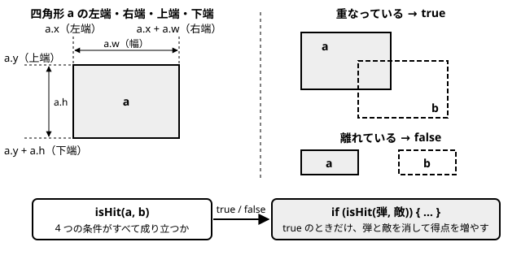
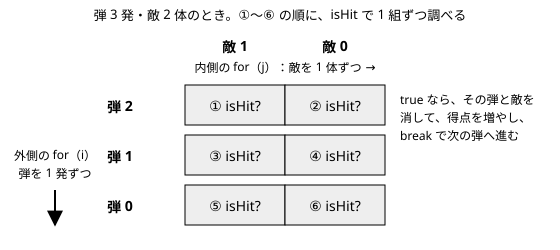

# 第26回　実践：Web ゲームプログラミング５（当たり判定と得点）

- **前回**：敵が出て、画面外で消えるようにした
- **今回**：弾が敵に当たると消え、得点が増える
- **次回**：jQuery で表示し、残機を作る

## 実習時のフォルダ構成

`Web_名前` の中に `26` フォルダを作る。第 25 回の `sample` フォルダと `exercise` フォルダを、`26` の中にコピーして、続きから作る。

```
Web_名前
└─ 26
   ├─ sample          ← 第 25 回の sample をコピーする
   │  ├─ index.html
   │  ├─ style.css
   │  └─ main.js
   └─ exercise        ← 第 25 回の exercise をコピーする
      ├─ index.html
      ├─ style.css
      └─ main.js
```

- `sample`：講義で使うサンプル（講義内容のコードは、`sample/main.js` に書き足す）
- `exercise`：自分のシューティングゲーム（演習１〜２）
- 今回は、`index.html` に得点の表示欄を 1 行追加する。`style.css` は変更しない。

## 講義内容

`sample/main.js` に書き足す。書いたら `sample/index.html` をブラウザで開いて確認する。

### 1. 前回の復習

- 敵は、`frameCount % 60 === 0` のとき（約 1 秒に 1 回）、乱数で決めた x 座標に出てくる。
- 画面の外に出た弾と敵は、後ろから回す `for` と `splice` で、配列から消す。

今回は、弾が敵に当たったら、弾と敵を消して、得点を増やす。得点は、第 20 回と同じ方法で HTML に表示する。

### 2. 今回の `main.js` の並び

```
// ===== 準備 =====           ← 得点の表示欄を取り出す scoreElement を追加する
// ===== ゲームの状態 =====   ← 得点の変数を追加する
// ===== 自機・弾・敵 =====
// ===== キー入力 =====
// ===== 更新 =====           ← isHit と checkBulletHits を追加し、update から呼び出す
// ===== 描画 =====
// ===== ゲームループ =====
```

### 3. 得点の表示欄と、得点の変数

`sample/index.html` の `<canvas>` の上に、得点の表示欄を 1 行追加する。

```html
<!DOCTYPE html>
<html lang="ja">
<head>
  <meta charset="UTF-8">
  <title>シューティングゲーム</title>
  <link rel="stylesheet" href="style.css">
</head>
<body>
  <p>SCORE: <span id="score">0</span></p>
  <canvas id="game" width="400" height="500"></canvas>
  <script src="main.js"></script>
</body>
</html>
```

- 第 20 回と同じ形。`SCORE:` の後ろの数字だけを `<span id="score">` で囲む。
- 得点は Canvas には描かず、HTML の表示欄に出す。Canvas には、自機・弾・敵などの動くものだけを描く。

`sample/main.js` の「準備」と「ゲームの状態」の部分を、次のようにする。

```javascript
// ===== 準備 =====
const canvas = document.getElementById("game");
const ctx = canvas.getContext("2d");
const scoreElement = document.getElementById("score");

// ===== ゲームの状態 =====
let score = 0;
let frameCount = 0;              // ゲーム開始からのフレーム数
```

- `scoreElement`：得点の表示欄（`<span id="score">`）を取り出して入れておく。第 20 回と同じ `getElementById`。

### 4. 四角形の当たり判定（isHit）

弾や敵は、`x`・`y`・`w`・`h` を持つ四角形。2 つの四角形が重なっているかを調べる関数 `isHit` を使う。



今回の中心は、図の下の段：**`isHit` が `true` か `false` を返し、その結果を `if` で使う**こと。`isHit` の中の 4 つの条件（すべて成り立てば重なっている）は、**覚える必要も、自分で考え出す必要もない**。次の表は、必要なときに見る参考。

| 条件 | 意味 |
|---|---|
| `a.x < b.x + b.w` | a の左端が、b の右端より左 |
| `a.x + a.w > b.x` | a の右端が、b の左端より右 |
| `a.y < b.y + b.h` | a の上端が、b の下端より上 |
| `a.y + a.h > b.y` | a の下端が、b の上端より下 |

「更新」の部分の `removeBullets` の下に、`isHit` を追加する。

```javascript
// 2 つの四角形が重なっていたら true を返す
function isHit(a, b) {
  return a.x < b.x + b.w && a.x + a.w > b.x && a.y < b.y + b.h && a.y + a.h > b.y;
}
```

- 第 20 回の「`return` で値を返す関数」。ここでは `true` か `false` を返す。弾も敵も自機も `x`・`y`・`w`・`h` を持つので、どの組み合わせにも使える。
- コンソールで試せる。`isHit({ x: 0, y: 0, w: 10, h: 10 }, { x: 5, y: 5, w: 10, h: 10 })` と入力すると `true`、2 つ目の `x` を `20` にすると `false` になる。

### 5. for の中の for（入れ子）と break

すべての弾と、すべての敵の組み合わせを調べるには、`for` の中に `for` を書く（`for` の入れ子）。

「更新」の部分の `isHit` の下に、`checkBulletHits` を追加する。

```javascript
// 弾と敵の当たり判定
function checkBulletHits() {
  for (let i = bullets.length - 1; i >= 0; i--) {
    for (let j = enemies.length - 1; j >= 0; j--) {
      if (isHit(bullets[i], enemies[j])) {
        bullets.splice(i, 1);
        enemies.splice(j, 1);
        score += 100;
        scoreElement.textContent = score;
        break;                   // この弾は消えたので、次の弾へ
      }
    }
  }
}
```



- 外側の `for`（`i`）で弾を 1 発選び、内側の `for`（`j`）で、その弾とすべての敵を 1 組ずつ調べる。内側と外側で、別の変数名（`i` と `j`）を使う。
- 消すことがあるので、第 25 回と同じく、どちらも後ろから回す。
- 当たったら、弾と敵を `splice` で消し（第 25 回と同じ）、得点を増やして表示を書き換える（第 20 回と同じ）。
- `break;` は、内側の `for` を途中で終わらせる。当たった弾はもう消えているので、次の弾へ進むために使う（続けると、消えた弾を調べてエラーになることがある）。

「更新」の部分の `update` を、次のようにする。

```javascript
function update() {
  frameCount += 1;
  updatePlayer();
  updateBullets();
  updateEnemies();
  removeEnemies();
  removeBullets();
  checkBulletHits();
}
```

- 当たり判定は、全員を動かして、画面外のものを消したあとに行う。
- 弾を当てると弾と敵が消え、画面の上の SCORE が 100 ずつ増える。

### 6. うまく動かないとき

| 症状 | 確認すること |
|---|---|
| 当たっても消えない | `update` から `checkBulletHits` を呼んでいるか。`isHit` の 4 つの条件の書き間違い |
| 得点の表示が変わらない | `index.html` の `id="score"` と、`getElementById("score")` の名前。`scoreElement.textContent = score;` を書いたか |
| `Cannot read properties of undefined` というエラー | `break;` を書いたか。`for` の条件（`i >= 0`、`j >= 0`） |
| `Cannot set properties of null` というエラー | `getElementById` の名前と、HTML の `id` が同じか |

## 演習

`exercise/main.js`（自分のシューティングゲーム）に書く。

### 演習１　当たり判定を作る

- 講義と同じように、`isHit` と `checkBulletHits` を追加して、弾が敵に当たると、弾と敵が消えるようにする。
- `checkBulletHits` は、次の空欄（`＿＿＿＿`）を埋めて完成させる（得点の 2 行は演習２で書く）。

```
function checkBulletHits() {
  for (let i = bullets.length - 1; i >= 0; i--) {
    for (let j = enemies.length - 1; j >= 0; j--) {
      if (isHit(＿＿＿＿, ＿＿＿＿)) {
        bullets.splice(＿＿＿＿, 1);
        enemies.splice(＿＿＿＿, 1);
        break;
      }
    }
  }
}
```

### 演習２　得点を HTML に表示する

- `exercise/index.html` に、講義と同じ得点の表示欄（`<p>SCORE: <span id="score">0</span></p>`）を追加する。
- `score` の変数と、表示欄を取り出す `scoreElement` を用意する。
- 敵を倒したら得点を増やし、表示を書き換える。1 体倒したときの得点は、自分で決める。
- 分からないときは、第 20 回の「ボタンを押すと得点が増える」を見直す。

## この回の終わりの `sample/main.js` 全体

```javascript
// ===== 準備 =====
const canvas = document.getElementById("game");
const ctx = canvas.getContext("2d");
const scoreElement = document.getElementById("score");

// ===== ゲームの状態 =====
let score = 0;
let frameCount = 0;              // ゲーム開始からのフレーム数

// ===== 自機・弾・敵 =====
const player = { x: 184, y: 440, w: 32, h: 32, speed: 5 };
let bullets = [];
let enemies = [];
let shotTimer = 0;               // 次の弾を撃てるまでのフレーム数

// ===== キー入力 =====
let isLeftPressed = false;
let isRightPressed = false;
let isSpacePressed = false;

document.addEventListener("keydown", function (event) {
  if (event.key === "ArrowLeft") {
    isLeftPressed = true;
  }
  if (event.key === "ArrowRight") {
    isRightPressed = true;
  }
  if (event.key === " ") {
    isSpacePressed = true;
  }
});

document.addEventListener("keyup", function (event) {
  if (event.key === "ArrowLeft") {
    isLeftPressed = false;
  }
  if (event.key === "ArrowRight") {
    isRightPressed = false;
  }
  if (event.key === " ") {
    isSpacePressed = false;
  }
});

// ===== 更新 =====
function updatePlayer() {
  if (isLeftPressed) {
    player.x -= player.speed;
  }
  if (isRightPressed) {
    player.x += player.speed;
  }
  // 画面の端で止める
  if (player.x < 0) {
    player.x = 0;
  }
  if (player.x + player.w > canvas.width) {
    player.x = canvas.width - player.w;
  }
}

function updateBullets() {
  if (shotTimer > 0) {
    shotTimer -= 1;
  }
  // スペースキーを押していて、撃てる状態なら、弾を追加する
  if (isSpacePressed && shotTimer === 0) {
    bullets.push({ x: player.x + player.w / 2 - 2, y: player.y, w: 4, h: 12, speed: 8 });
    shotTimer = 10;
  }
  // すべての弾を上へ動かす
  for (let i = 0; i < bullets.length; i++) {
    bullets[i].y -= bullets[i].speed;
  }
}

function updateEnemies() {
  // 60 フレーム（約 1 秒）ごとに、敵を 1 体出す
  if (frameCount % 60 === 0) {
    enemies.push({ x: Math.floor(Math.random() * (canvas.width - 32)), y: -32, w: 32, h: 32, speed: 2 });
  }
  // すべての敵を下へ動かす
  for (let i = 0; i < enemies.length; i++) {
    enemies[i].y += enemies[i].speed;
  }
}

// 画面の下に出た敵を消す
function removeEnemies() {
  for (let i = enemies.length - 1; i >= 0; i--) {
    if (enemies[i].y > canvas.height) {
      enemies.splice(i, 1);
    }
  }
}

// 画面の上に出た弾を消す
function removeBullets() {
  for (let i = bullets.length - 1; i >= 0; i--) {
    if (bullets[i].y + bullets[i].h < 0) {
      bullets.splice(i, 1);
    }
  }
}

// 2 つの四角形が重なっていたら true を返す
function isHit(a, b) {
  return a.x < b.x + b.w && a.x + a.w > b.x && a.y < b.y + b.h && a.y + a.h > b.y;
}

// 弾と敵の当たり判定
function checkBulletHits() {
  for (let i = bullets.length - 1; i >= 0; i--) {
    for (let j = enemies.length - 1; j >= 0; j--) {
      if (isHit(bullets[i], enemies[j])) {
        bullets.splice(i, 1);
        enemies.splice(j, 1);
        score += 100;
        scoreElement.textContent = score;
        break;                   // この弾は消えたので、次の弾へ
      }
    }
  }
}

function update() {
  frameCount += 1;
  updatePlayer();
  updateBullets();
  updateEnemies();
  removeEnemies();
  removeBullets();
  checkBulletHits();
}

// ===== 描画 =====
function drawBackground() {
  ctx.fillStyle = "#000022";
  ctx.fillRect(0, 0, canvas.width, canvas.height);
}

function drawPlayer() {
  ctx.fillStyle = "#00ccff";
  ctx.fillRect(player.x, player.y, player.w, player.h);
}

function drawBullets() {
  ctx.fillStyle = "#ffff00";
  for (let i = 0; i < bullets.length; i++) {
    ctx.fillRect(bullets[i].x, bullets[i].y, bullets[i].w, bullets[i].h);
  }
}

function drawEnemies() {
  ctx.fillStyle = "#ff4444";
  for (let i = 0; i < enemies.length; i++) {
    ctx.fillRect(enemies[i].x, enemies[i].y, enemies[i].w, enemies[i].h);
  }
}

function draw() {
  drawBackground();
  drawPlayer();
  drawBullets();
  drawEnemies();
}

// ===== ゲームループ =====
function gameLoop() {
  update();
  draw();
  requestAnimationFrame(gameLoop);
}

gameLoop();
```
