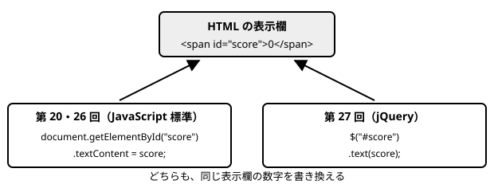

# 第27回　実践：Web ゲームプログラミング６（jQuery と残機）

- **前回**：当たり判定と得点表示を作った
- **今回**：jQuery で得点・残機を表示し、敵にぶつかると残機が減るようにする
- **次回**：ゲームオーバーとリスタート

## 実習時のフォルダ構成

`Web_名前` の中に `27` フォルダを作る。第 26 回の `sample` フォルダと `exercise` フォルダを、`27` の中にコピーして、続きから作る。

```
Web_名前
└─ 27
   ├─ sample          ← 第 26 回の sample をコピーする
   │  ├─ index.html
   │  ├─ style.css
   │  └─ main.js
   └─ exercise        ← 第 26 回の exercise をコピーする
      ├─ index.html
      ├─ style.css
      └─ main.js
```

- `sample`：講義で使うサンプル（講義内容のコードは、`sample/main.js` に書き足す）
- `exercise`：自分のシューティングゲーム（演習１〜２）
- 今回は、`index.html` に残機の表示と、jQuery の読み込みを追加する。`style.css` は変更しない。

## 講義内容

### 1. 前回の復習

- `isHit(a, b)`：2 つの四角形が重なっていたら `true` を返す関数。
- `checkBulletHits`：`for` の入れ子で、すべての弾とすべての敵を比べる。当たったら両方を消し、得点を増やして、`scoreElement.textContent = score;` で表示を書き換える。

今回は、次の 2 つを行う。

- HTML の表示の書き換えを、jQuery という書き方に変える。
- 敵が自機にぶつかったら、残機を 1 減らして表示する。

### 2. jQuery とは

jQuery（ジェイクエリー）は、HTML を JavaScript で操作するための道具（ライブラリ）。第 20 回で、JavaScript に最初から用意されている方法（`getElementById` と `.textContent`）を学んだ。だから今回は、「同じことを、別の書き方で短く書ける」と比べて理解できる。



- `$("#score")`：`id` が `score` の要素を取り出す。`#` は、前期の CSS の「ID セレクタ」（`#title { }`）と同じ意味。
- `.text(値)`：取り出した要素の中の文字を、その値に書き換える。
- jQuery で使うのは、この授業では、今回の `$("#id")` と `.text( )`、次回の `.show( )`・`.hide( )`・`.on( )` の 4 種類だけ。

### 3. jQuery を読み込む

jQuery は、JavaScript に最初から入っているものではないので、読み込む必要がある。この授業では、jQuery の公式の配布場所（CDN）から読み込む。

`sample/index.html` を、次のようにする（残機の表示も、ここで追加する）。

```html
<!DOCTYPE html>
<html lang="ja">
<head>
  <meta charset="UTF-8">
  <title>シューティングゲーム</title>
  <link rel="stylesheet" href="style.css">
</head>
<body>
  <p>SCORE: <span id="score">0</span>　LIVES: <span id="lives">3</span></p>
  <canvas id="game" width="400" height="500"></canvas>
  <script src="https://code.jquery.com/jquery-4.0.0.min.js" integrity="sha384-fgGyf7Mo7DURSOMnOy7ed+dkq5Job205Gnzu6QIg0BOHKaqt4D76Dt8VlDCzcMHV" crossorigin="anonymous"></script>
  <script src="main.js"></script>
</body>
</html>
```

- jQuery の `<script>` は、`main.js` の `<script>` より**前**に書く。先に jQuery を読み込んでおかないと、`main.js` の中で `$` が使えない。
- `integrity="..."` と `crossorigin="anonymous"` は、読み込んだファイルが書き換えられていないかを、ブラウザが確かめるための設定。この 1 行は、そのまま書き写す。
- CDN を使うと、jQuery のファイルを自分のフォルダに置かなくても、全員が同じバージョン（4.0.0）を読み込める。
- CDN は、インターネットにつながっていないと使えない。学校のネットワーク環境で CDN を利用できない場合は、講師が配布した jQuery のファイルを使用する（`main.js` に書く jQuery のコードは同じ）。

### 4. 今回の `main.js` の並び

```
// ===== 準備 =====           ← scoreElement の 1 行を消す
// ===== ゲームの状態 =====   ← 残機の変数を追加する
// ===== 自機・弾・敵 =====
// ===== キー入力 =====
// ===== 更新 =====           ← checkBulletHits の表示の行を書き換え、checkPlayerHit を追加する
// ===== 描画 =====
// ===== ゲームループ =====
```

### 5. 得点の表示を jQuery に書き換える

「準備」の部分の `const scoreElement = document.getElementById("score");` の行を消す。jQuery では、`$("#score")` で、その場で要素を取り出せるため。

「ゲームの状態」の部分に、残機の変数 `lives` を追加する。

```javascript
// ===== ゲームの状態 =====
let score = 0;
let lives = 3;
let frameCount = 0;              // ゲーム開始からのフレーム数
```

`checkBulletHits` の中の、表示を書き換える 1 行を、次のように書き換える。

```
scoreElement.textContent = score;     ← 第 26 回（Vanilla JavaScript）
$("#score").text(score);              ← 今回（jQuery）
```

```javascript
// 弾と敵の当たり判定
function checkBulletHits() {
  for (let i = bullets.length - 1; i >= 0; i--) {
    for (let j = enemies.length - 1; j >= 0; j--) {
      if (isHit(bullets[i], enemies[j])) {
        bullets.splice(i, 1);
        enemies.splice(j, 1);
        score += 100;
        $("#score").text(score);
        break;                   // この弾は消えたので、次の弾へ
      }
    }
  }
}
```

- 敵を倒すと、今までと同じように SCORE が増えることを確かめる。やっていることは同じで、書き方だけが変わった。

### 6. 敵と自機の当たり判定（checkPlayerHit）

「更新」の部分の `checkBulletHits` の下に、`checkPlayerHit` を追加する。

```javascript
// 敵と自機の当たり判定
function checkPlayerHit() {
  for (let i = enemies.length - 1; i >= 0; i--) {
    if (isHit(player, enemies[i])) {
      enemies.splice(i, 1);
      lives -= 1;
      $("#lives").text(lives);
      break;                     // 1 フレームで減る残機は 1 つまで
    }
  }
}
```

- 前回作った `isHit` を、そのまま使い回している。`player` も `enemies[i]` も、`x`・`y`・`w`・`h` を持つオブジェクトなので、同じ関数で判定できる。
- 自機は 1 つなので、`for` は入れ子にならない。すべての敵と、自機を比べる。
- ぶつかった敵を消して、残機を 1 減らし、`$("#lives").text(lives);` で表示を書き換える。
- 敵が 2 体同時にぶつかっても、残機が一度に 2 つ減らないように、`break` で `for` を終わらせる。

「更新」の部分の `update` を、次のようにする。

```javascript
function update() {
  frameCount += 1;
  updatePlayer();
  updateBullets();
  updateEnemies();
  removeEnemies();
  removeBullets();
  checkBulletHits();
  checkPlayerHit();
}
```

- 敵にぶつかると、敵が消えて、LIVES が 1 減る。
- 今は、残機が 0 になってもゲームが続き、LIVES がマイナスになる。ゲームオーバーは、次回作る。

### 7. うまく動かないとき

| 症状 | 確認すること |
|---|---|
| `$ is not defined` というエラー | jQuery の `<script>` を書いたか。`main.js` より前に書いたか。インターネットにつながっているか |
| 表示が変わらない（エラーなし） | `$("#score")` の `#` を忘れていないか。HTML の `id` と同じ名前か |
| 残機が減らない | `update` から `checkPlayerHit` を呼んでいるか |
| 残機が一度に 2 つ以上減る | `checkPlayerHit` に `break;` があるか |

## 演習

`exercise/main.js`（自分のシューティングゲーム）に書く。

### 演習１　得点の表示を jQuery に書き換える

- `exercise/index.html` に、jQuery の `<script>` を `main.js` の前に追加する（講義の 3 と同じ 1 行）。
- `scoreElement` の行を消し、`checkBulletHits` の表示の行を `$("#score").text(score);` に書き換える。
- 敵を倒して、今までと同じように得点が増えることを確かめる。

### 演習２　残機を作る

- `exercise/index.html` の得点の表示欄に、残機の表示（`LIVES: <span id="lives">3</span>`）を追加する。
- `lives` の変数と `checkPlayerHit` を追加し、敵にぶつかると残機が減って、表示も変わるようにする。

## この回の終わりの `sample/main.js` 全体

```javascript
// ===== 準備 =====
const canvas = document.getElementById("game");
const ctx = canvas.getContext("2d");

// ===== ゲームの状態 =====
let score = 0;
let lives = 3;
let frameCount = 0;              // ゲーム開始からのフレーム数

// ===== 自機・弾・敵 =====
const player = { x: 184, y: 440, w: 32, h: 32, speed: 5 };
let bullets = [];
let enemies = [];
let shotTimer = 0;               // 次の弾を撃てるまでのフレーム数

// ===== キー入力 =====
let isLeftPressed = false;
let isRightPressed = false;
let isSpacePressed = false;

document.addEventListener("keydown", function (event) {
  if (event.key === "ArrowLeft") {
    isLeftPressed = true;
  }
  if (event.key === "ArrowRight") {
    isRightPressed = true;
  }
  if (event.key === " ") {
    isSpacePressed = true;
  }
});

document.addEventListener("keyup", function (event) {
  if (event.key === "ArrowLeft") {
    isLeftPressed = false;
  }
  if (event.key === "ArrowRight") {
    isRightPressed = false;
  }
  if (event.key === " ") {
    isSpacePressed = false;
  }
});

// ===== 更新 =====
function updatePlayer() {
  if (isLeftPressed) {
    player.x -= player.speed;
  }
  if (isRightPressed) {
    player.x += player.speed;
  }
  // 画面の端で止める
  if (player.x < 0) {
    player.x = 0;
  }
  if (player.x + player.w > canvas.width) {
    player.x = canvas.width - player.w;
  }
}

function updateBullets() {
  if (shotTimer > 0) {
    shotTimer -= 1;
  }
  // スペースキーを押していて、撃てる状態なら、弾を追加する
  if (isSpacePressed && shotTimer === 0) {
    bullets.push({ x: player.x + player.w / 2 - 2, y: player.y, w: 4, h: 12, speed: 8 });
    shotTimer = 10;
  }
  // すべての弾を上へ動かす
  for (let i = 0; i < bullets.length; i++) {
    bullets[i].y -= bullets[i].speed;
  }
}

function updateEnemies() {
  // 60 フレーム（約 1 秒）ごとに、敵を 1 体出す
  if (frameCount % 60 === 0) {
    enemies.push({ x: Math.floor(Math.random() * (canvas.width - 32)), y: -32, w: 32, h: 32, speed: 2 });
  }
  // すべての敵を下へ動かす
  for (let i = 0; i < enemies.length; i++) {
    enemies[i].y += enemies[i].speed;
  }
}

// 画面の下に出た敵を消す
function removeEnemies() {
  for (let i = enemies.length - 1; i >= 0; i--) {
    if (enemies[i].y > canvas.height) {
      enemies.splice(i, 1);
    }
  }
}

// 画面の上に出た弾を消す
function removeBullets() {
  for (let i = bullets.length - 1; i >= 0; i--) {
    if (bullets[i].y + bullets[i].h < 0) {
      bullets.splice(i, 1);
    }
  }
}

// 2 つの四角形が重なっていたら true を返す
function isHit(a, b) {
  return a.x < b.x + b.w && a.x + a.w > b.x && a.y < b.y + b.h && a.y + a.h > b.y;
}

// 弾と敵の当たり判定
function checkBulletHits() {
  for (let i = bullets.length - 1; i >= 0; i--) {
    for (let j = enemies.length - 1; j >= 0; j--) {
      if (isHit(bullets[i], enemies[j])) {
        bullets.splice(i, 1);
        enemies.splice(j, 1);
        score += 100;
        $("#score").text(score);
        break;                   // この弾は消えたので、次の弾へ
      }
    }
  }
}

// 敵と自機の当たり判定
function checkPlayerHit() {
  for (let i = enemies.length - 1; i >= 0; i--) {
    if (isHit(player, enemies[i])) {
      enemies.splice(i, 1);
      lives -= 1;
      $("#lives").text(lives);
      break;                     // 1 フレームで減る残機は 1 つまで
    }
  }
}

function update() {
  frameCount += 1;
  updatePlayer();
  updateBullets();
  updateEnemies();
  removeEnemies();
  removeBullets();
  checkBulletHits();
  checkPlayerHit();
}

// ===== 描画 =====
function drawBackground() {
  ctx.fillStyle = "#000022";
  ctx.fillRect(0, 0, canvas.width, canvas.height);
}

function drawPlayer() {
  ctx.fillStyle = "#00ccff";
  ctx.fillRect(player.x, player.y, player.w, player.h);
}

function drawBullets() {
  ctx.fillStyle = "#ffff00";
  for (let i = 0; i < bullets.length; i++) {
    ctx.fillRect(bullets[i].x, bullets[i].y, bullets[i].w, bullets[i].h);
  }
}

function drawEnemies() {
  ctx.fillStyle = "#ff4444";
  for (let i = 0; i < enemies.length; i++) {
    ctx.fillRect(enemies[i].x, enemies[i].y, enemies[i].w, enemies[i].h);
  }
}

function draw() {
  drawBackground();
  drawPlayer();
  drawBullets();
  drawEnemies();
}

// ===== ゲームループ =====
function gameLoop() {
  update();
  draw();
  requestAnimationFrame(gameLoop);
}

gameLoop();
```
